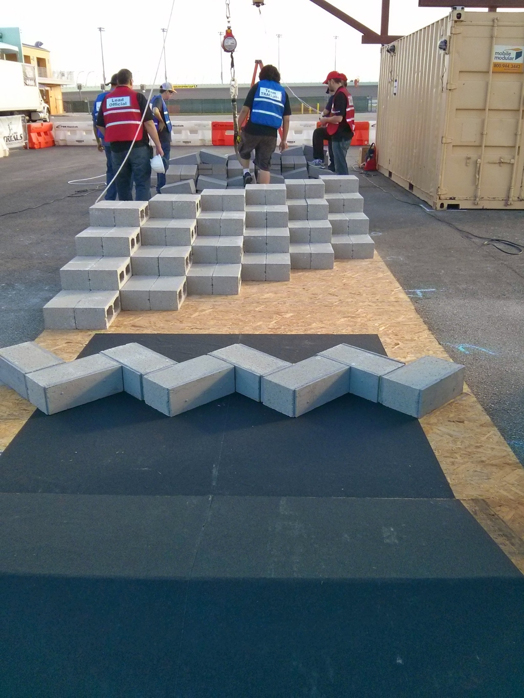
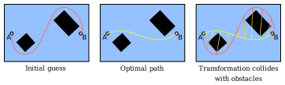

<style type="text/css">
.reveal ul {
    font-size: smaller;
}
</style>

### Learning from Value Function Intervals for Contact-Aware Robot Controllers

Robin Deits

MIT CSAIL: Robot Locomotion Group

October 15, 2018

<http://people.csail.mit.edu/rdeits/phd-defense>

----

### Motivation

<div style="font-size: 20pt">Legged robots offer exceptional mobility and access to parts of the world that other robots cannot reach, but every movement they make requires a complex and coordinated set of contacts with the external world: stepping, climbing, leaning, or stumbling. We want to allow robots to use contact with the world to move around safely and reliably in any environment.</div>
<iframe width="560" height="315" src="https://www.youtube.com/embed/wND9goxDVrY?rel=0&amp;showinfo=0&amp;start=70" frameborder="0" allow="autoplay; encrypted-media" allowfullscreen></iframe>

----

### Abstract

* We can write down and solve mixed-integer trajectory optimization problems to plan multi-contact behaviors for walking robots.
* Unfortunately, these optimization problems are too slow to be solved online when reacting to disturbances.
* Instead, by *partially* solving a large number of mixed-integer trajectory optimizations ahead of time, we can train a neural net to approximate the value function (cost-to-go) of the optimal controller.
* This approximate value function can be used along with a much simpler online optimization to control the robot while still making useful contact decisions.

----

### Outline

<table >
    <tr>
        <td>
            
        </td>
        <td style="vertical-align: middle; font-size:20pt"> 1: Background: Footstep and Motion Planning </td>
    </tr>
    <tr>
        <td>
            
        </td>
        <td style="vertical-align: middle; font-size:20pt">
            2: Thesis Topic: Learning from Value Function Intervals for Contact-Aware Robot Controllers
        </td>
    </tr>
    <tr>
        <td >
            
        </td>
        <td style="vertical-align: middle; font-size:20pt">
            3: Future Work
        </td>
    </tr>
</table>

---

### 1: Background: Footstep and Motion Planning


----

### Virtual Robotics Challenge: Basic Footstep Planning

<video data-autoplay src="static/video/MIT_VRC_Summary_trimmed.m4v" height="450" controls >
</video>

<div style="font-size: 12pt">Tedrake et al. "A Summary of Team MIT’s Approach to the Virtual Robotics Challenge". ICRA 2014.</div>


----

### DARPA Robotics Challenge: Rough Terrain Footstep Planning

<table>
    <tr>
        <td>
            
        </td>
        <td style="vertical-align: middle;">
            
        </td>
    </tr>
</table>

----

### The Footstep Planner (2013)


----

### Why is Footstep Planning Hard?

* Optimization around obstacles is hard, and tends to result in poor-quality local optima when the solver gets trapped on the wrong side on an obstacle:



----

### Optimal Mixed-Integer Footstep Planning

* Instead, what if we:
    * Decompose the obstacle-free space into convex pieces
    * Require that every footstep pose must be assigned one of those safe convex pieces
    * Optimize over the pose of each footstep *and* its assignment simultaneously as a mixed-integer program

----

### Convex Decomposition

<div style="flex-direction: row">
    
    
</div>
<br>

----

### Convex Decomposition: IRIS

<div style="flex-direction: row; display: flex">
    
    <div>
        <ul>
            <li>Given</li>
            <ul>
                <li>List of obstacles</li>
                <li>Single point in free space</li>
            </ul>
            <li>Computes</li>
            <ul>
                <li>One large convex polytopic region of free space</li>
                <li>The maximal ellipsoid within that region</li>
            </ul>
        </ul>
    </div>
</div>

<div style="font-size: 12pt; text-align: left">
<p>IRIS: Iterative Region Inflation through SDP
<p>Robin Deits and Russ Tedrake. "Computing large convex regions of obstacle-free space through semidefinite programming". WAFR 2014.
</div>
----

### Globally Optimal Mixed-Integer Footstep Planning

* If we have all of these:
    * Convex cost function
    * Convex constraints (such as being contained in a convex region)
    * Integer (discrete) variables (choice of which convex region to use for each foot)
* Then we have a Mixed-Integer Convex Program, which we can solve to global optimality with commercial solvers (Mosek, Gurobi, CPLEX, etc.)
    * We can simultaneously solve for both the continuous positions of each footstep and their discrete assignments to safe regions in a single optimization
    * But it gets harder with more integer variables

----

### Optimal Mixed-Integer Footstep Planning

<video data-autoplay src="static/video/humanoids-2014-trimmed.m4v" height="450" controls >
</video>

<div style="font-size: 12pt">Robin Deits and Russ Tedrake. "Footstep Planning on Uneven Terrain with Mixed-Integer Convex Optimization". Humanoids 2014.</div>

----

### Online Mixed-Integer Footstep Planning

<video data-autoplay src="static/video/terrain.mp4" height="450" controls />
</video>

<div style="font-size: 14pt">Drake: A planning, control, and analysis toolbox for nonlinear dynamical systems. <a href="https://drake.mit.edu">https://drake.mit.edu</a></div>

----

### Online Mixed-Integer Footstep Planning

<video data-autoplay src="static/video/continuous_walking.mp4" height="450" controls />
</video>

<div style="font-size: 14pt">Maurice Fallon et al. "Continuous humanoid locomotion over uneven terrain using stereo fusion". Humanoids 2015.</div>

----

### Mixed-Integer Trajectory Planning

* Instead of footsteps, what if we think about segments of a trajectory for a UAV?
* We can run a similar mixed-integer optimization to compute:
    * The coefficients of a polynomial trajectory
    * The assignment of each piece to some convex region of safe space
    * A sum-of-squares proof that the entire trajectory (not just a set of knot points) is collision-free

<div style="flex-direction: row; ">
    
    
</div>

<div style="font-size: 14pt">Robin Deits and Russ Tedrake. "Efficient mixed-integer planning for UAVs in cluttered environments". ICRA 2015.</div>

----

### Mixed-Integer Trajectory Planning

<video data-autoplay src="static/video/ICRA_2015_720p-526.mp4" height="450" controls >
</video>

<div style="font-size: 14pt">Robin Deits and Russ Tedrake. "Efficient mixed-integer planning for UAVs in cluttered environments". ICRA 2015.</div>

----

### Discussion

* There is a common theme in this work:
    * Segment the environment
    * Plan an optimal trajectory
    * Execute that trajectory without significant modification
        * Necessary because these optimizations are **slow**
* The limitations of this approach become clear when the environment becomes more challenging

----

### Limitations of Planning

<div style="display: flex; flex-direction: column; height: 100vh">
    <div style="vertical-align: middle;">
        <video data-autoplay src="static/video/egress.mp4" controls height="250px" >
        </video>
    </div>
    <div>
        
        <div style="font-size: 10pt;">Photo: DARPA</div>
    </div>
</div>

----

### Limitations


* When our robots move, they do so with a fixed, pre-planned, time-coded contact sequence
* When the real world does not cooperate, we fall

---

### 2: Learning from Value Function Intervals for Contact-Aware Robot Controllers


----

### Motivation

* We want robots that can react to disturbances by deciding to make or break contact
* We will limit ourselves to simple center-of-mass models with approximate kinematics:

<table>
    <tr>
        <th>Atlas Robot</th>
        <th>Model</th>
        <th>Simplified Humanoid</th>
    </tr>
    <tr>
        <td>
            
        </td>
        <td>
            
        </td>
        <td>
            
        </td>
    </tr>
</table>

----

### Motivation

* Why is this hard?
    * Existing robust tools like LQR assume a single, linear dynamics
    * Contact events create discontinuities in the dynamics and violate that assumption
    * Even planning dynamic motions with contact is difficult
        * Contact-implicit trajectory optimization (Michael Posa)
        * Trajectory optimization with centroidal dynamics (Andres Valenzuela and Hongkai Dai)
        * Mixed-integer trajectory optimization (Andres Valenzuela)

----

### Existing Approaches

* Differential Dynamic Programming / Iterative LQR
    * Efficient nonlinear trajectory optimization
    * Todorov, Neunert, Giftthaler, Carius, and others
* Computing the contact schedule ahead of time
    * Marcucci, 2017: finding a library of feasible, stable mode sequences by solving mixed-integer programs ahead of time
    * Hogan, 2017: training a classifier to predict mode sequences by solving mixed-integer programs ahead of time
* Finding a stabilizing Lyapunov function
    * Han, 2017: stabilizing policies with Linear Matrix Inequalities
* Explicit hybrid MPC
    * Bemporad and others
* Approximations of explicit MPC
    * Chen, 2018: "Approximating Explicit Model Predictive Control Using Constrained Neural Networks"

----

### Approach: MPC

* We’ll describe our problem in the language of Model-Predictive Control:
    * Choose the robot’s state and action over the next N time steps...
        * ...to optimize some cost over state and action...
        * ...subject to the robot’s dynamics...
        * ...and respecting state and action constraints
    * Apply the optimal action for a single time step
    * Repeat the optimization


----

### MPC Details

* Most hybrid MPC work assumes that our system is *explicitly* hybrid:
    * $\dot{x} = A_i x + B_i u, \quad x \in X_i, u \in U_i \quad i \in 1, \dots, N $
* Instead, we will use a contact-*implicit* formulation with complementarity conditions (Stewart & Trinkle, 2000):
    * $\phi \geq 0 \perp f \geq 0$ for separation $\phi$ and contact force $f$
        * $\phi \geq 0$
        * $f \geq 0$
        * $\phi = 0 \~\text{OR}\~ f = 0$
* No explicit $A_i$ for each mode, instead modes are indicated by which side of each complementarity condition is zero
    * Similar to Michael Posa's contact-implicit trajectory optimization, but modeling complementarity as hard binary constraints

----

### MPC Details

* For each complementarity condition $\phi \geq 0 \perp f \geq 0$, we will add a single binary decision variable to determine which variable is constrained to zero
* I developed `ConditionalJuMP` to handle this process automatically, allowing statements like:
```julia
@disjunction(model, separation_from_obstacle == 0, contact_force == 0)
```
to be converted into the appropriate mixed-integer constraints.

----

### Approach: Mixed-Integer MPC

* We will model our robot’s dynamics as linear and use a quadratic cost function
    * Instead of a discrete choice among safe regions, we will make a discrete choice for each complementarity condition
* This lets us write down the MPC optimization as a Mixed-Integer Quadratic Program (MIQP)
    * The branch-and-bound algorithm can solve MIQP optimizations to *global optimality*...
    * ...although this can potentially take an extremely long time
* Branch-and-bound iterates between finding better solutions and finding tighter bounds on the best solution, so we can also terminate it early and get a sub-optimal result.

----

### Optimization Ahead-of-Time

* What if, for a particular environment, we could solve enough difficult mixed-integer MPC problems ahead of time and learn the resulting policy from those examples?
    * Essentially an approximation of the hybrid explicit MPC approach, or an equivalent to Guided Policy Search
* Advantages:
    * Online control would become trivial (essentially a lookup table)
    * Piecewise affine structure of the true solution can make learning easier
* Disadvantages:
    * Sampling in high-dimensional space is hard (but DAgger can help)
    * Actually solving the mixed-integer MPC problems to global optimality can take minutes or even hours <it>per sample</it>

----

### Learned Policy: Cart-Pole

<video data-autoplay src="static/img/cart-pole-net-half-speed.ogv" height="500" controls>

----

### Limitations

* The idea of learning an explicit MPC policy fell apart for robots like our simplified humanoid.
    * Solving each individual optimization could take minutes or more, and we needed thousands of samples
    * We can partially solve each optimization (terminating before we have a proof of optimality), but then our network is learning from bad data.
* We need a better approach.

----

### Observations

* Observation 1: The branch-and-bound algorithm provides rigorous upper and lower bounds on the optimal objective *even if we stop early*.
* Observation 2: If we know the objective value of an MPC problem, then we know the *cost-to-go* from the robot's current state.
* Observation 3: If we have a model for the cost-to-go, then we can just greedily descend that cost function online and recover the optimal MPC behavior.

----

### Learning Value Functions from Bounded Optimization

* Offline:
    * Set up a large number of mixed-integer MPC optimizations, but terminate their solutions very early
    * Extract bounds on the optimal cost-to-go from each optimization
    * Train a neural net to approximate the cost-to-go given those bounds
        * Two-sided hinge loss penalizes the neural net for estimating a cost-to-go which is above or below the known bounds
* Online:
    * Use the learned cost-to-go to control the robot by solving a 1-step MPC optimization
* We call this `LVIS` (Learning from Value Interval Samples)

----

### LVIS Details

* For the planar humanoid robot model (22 state variables), we used:
    * Offline:
        * 37,000 trajectory optimization samples, each terminated after 3 seconds (36 hours of CPU time)
            * Each sample contributed a triplet of: (robot state, value function lower bound, value function upper bound)
        * Neural net with two hidden layers (48 units each) and ELU activations
        * ADAM optimizer with $\ell_2$ regularization
        * DAgger for sample collection
    * Online:
        * One-step mixed-integer MPC using the learned cost-to-go, running at simulated 100 Hz


----

### LVIS Example

* Example: cost-to-go learned from the simplified humanoid robot model. Note how the learned cost-to-go deviates farther from LQR as the initial conditions become more extreme.


----

### Assumptions

* We are assuming that...
    * ...a linear model of the robot's dynamics is sufficient.
        * Neglects the bilinear effects of torque: $\tau = r \times f$ when $r$ and $f$ are both decision variables.
        * Neglects the nonlinear way the robot's kinematics and dynamics change as its body rotates.
    * ...the optimal objective value of the mixed-integer trajectory optimization is actually a sample of the optimal cost-to-go.
        * Also relies on the linearization assumption above.
        * Assumes that there is some set of states for which we know the true cost-to-go, and that the trajectory optimization has a long enough horizon to reach that set
            * Instead, we will use as long a horizon as we can and use the LQR cost as an estimate of the cost-to-go at the end of the horizon.
    * ...the environment is fixed.
        * We'll show some early work on applying LVIS to a parameterized family of environments

----

### Results

Initial velocity: $-2 \frac{m}{s}$

<table>
    <tr>
        <th>LVIS</th>
        <th>LQR + MPC</th>
    </tr>
    <tr>
        <td>
<video data-autoplay src="static/img/trajectories/net-left-2mps-half-speed.m4v" height="300" controls>
        </td>
        <td>
<video data-autoplay src="static/img/trajectories/lqr-left-2mps-half-speed.m4v" height="300" controls>
        </td>
    </tr>
</table>

----

### Results

Initial velocity: $-1 \frac{m}{s}$

<table>
    <tr>
        <th>LVIS</th>
        <th>LQR + MPC</th>
    </tr>
    <tr>
        <td>
<video data-autoplay src="static/img/trajectories/net-left-1mps-half-speed.m4v" height="300" controls>
        </td>
        <td>
<video data-autoplay src="static/img/trajectories/lqr-left-1mps-half-speed.m4v" height="300" controls>
        </td>
    </tr>
</table>

----

### Results

Initial velocity: $-0.5 \frac{m}{s}$

<table>
    <tr>
        <th>LVIS</th>
        <th>LQR + MPC</th>
    </tr>
    <tr>
        <td>
<video data-autoplay src="static/img/trajectories/net-left-0.5mps-half-speed.m4v" height="300" controls>
        </td>
        <td>
<video data-autoplay src="static/img/trajectories/lqr-left-0.5mps-half-speed.m4v" height="300" controls>
        </td>
    </tr>
</table>

----

### Results

Initial velocity: $+1 \frac{m}{s}$

<table>
    <tr>
        <th>LVIS</th>
        <th>LQR + MPC</th>
    </tr>
    <tr>
        <td>
<video data-autoplay src="static/img/trajectories/net-right-1mps-half-speed.m4v" height="300" controls>
        </td>
        <td>
<video data-autoplay src="static/img/trajectories/lqr-right-1mps-half-speed.m4v" height="300" controls>
        </td>
    </tr>
</table>

----

### Results: Accumulated Cost


<div style="font-size: 18pt; text-align: left;">Each cell indicates
the total accumulated cost over a 4-second simulation from the given initial
linear and angular velocity of the robot’s body. Dark blue is better.</div>

----

### Comparison: Policy Search

* Can we just learn the policy directly?
    * No: sampling from the policy requires solving all the way to optimality, and the resulting function may not even be unique.
    * Let's try it anyway:


<div style="font-size: 18pt; text-align: left;">Each cell indicates
the total accumulated cost over a 4-second simulation from the given initial
linear and angular velocity of the robot’s body.</div>

----

### Comparison: Capture Point

* What if the MPC + LQR controller we're comparing against just isn't very good?
    * Let's compare against the region of Zero-Step Capturability (Pratt et al.):


<div style="font-size: 18pt; text-align: left;">Each cell indicates
the total accumulated cost over a 4-second simulation from the given initial
linear and angular velocity of the robot’s body. Yellow shaded region is the predicted Zero-Step Capturability basin.</div>

----

### Comparison: Upper/Lower Bounds Only

* Is the value *interval* necessary? Or could we train from just the lower bounds or upper bounds generated by branch-and-bound?


----

### Comparison: Full Optimality

* What if we actually wait for branch-and-bound to converge in order to get much tighter bounds on the cost-to-go?


<div style="font-size: 18pt; text-align: left;">54 samples, collected over 18 hours of CPU time. One sample, terminated after 27,775 seconds without converging, is not shown here.</div>

---

### 3: Conclusions and Future Work


----

### Contributions

* We've introduced LVIS, a tool for multi-contact control for a humanoid robot via:
    * Offline trajectory optimization pipeline based on mixed-integer quadratic programming and branch-and-bound.
    * Early termination to produce global bounds on the cost-to-go
    * Learning an approximate cost-to-go from those bounds
    * Online mixed-integer QP control using the learned cost
* Rather than making a single optimal plan, we've created a controller that make its own contact decisions online.

----

### Future Work

* Two major open issues with this approach are:
    * Handling varying environments
    * Handling nonlinear dynamics

----

### Parameterized Environments

* Instead of a single fixed environment, we can train over a family of parameterized environments.
    * The resulting cost-to-go is a function of robot state **and** environment parameters.
* To test this idea, we trained a cost-to-go for the cart-pole system, varying the separation between the walls ($p_1$):


----

### Parameterized Environments

* The resulting cost-to-go includes the effects of predicted contact, which varies with how far away the walls are.
* Here's a slice of that cost-to-go at $q_1 = 0,~q_2 = 0,~\\dot{q}_2 = 0$, with varying cart velocity $q_1$ and wall separation $p_1$:


----

### Future Work: Nonlinear Models

* We're still assuming that a linearized model is sufficient for trajectory optimization.
* Future work being carried out by others in the Locomotion group will investigate the use of global mixed-integer nonlinear optimization (using solvers like COUENNE or Baron) to provide LVIS intervals with no linearization required.

----

### Conclusions

* Global optimization is a powerful technique for robot motion planning, but generally too slow for online control.
* We can learn valuable information from global optimizations even if we don't run them all the way to optimality.
* We can train a useful online controller from those optimizations, by learning from the bounds we get on the cost-to-go.
* The resulting controller can control systems with complex contact modes without needing any sort of contact schedule or plan.

----

### Thank You

* I could not have made it this far without...
    * My parents, who made sure I turned out OK
    * Michele, who read everything I ever wrote
    * The Locomotion group, who inspired me every day
    * The JuliaOpt, JuliaRobotics, and Drake developers
    * My committee: Peko, Alberto, and Leslie
    * Russ, who kept me pointed in the right direction
* For more details, see:
    * Paper: <https://arxiv.org/abs/1809.05802>
    * Code: <https://github.com/rdeits/LVIS-dev>
    * Slides: <http://people.csail.mit.edu/rdeits/phd-defense>


